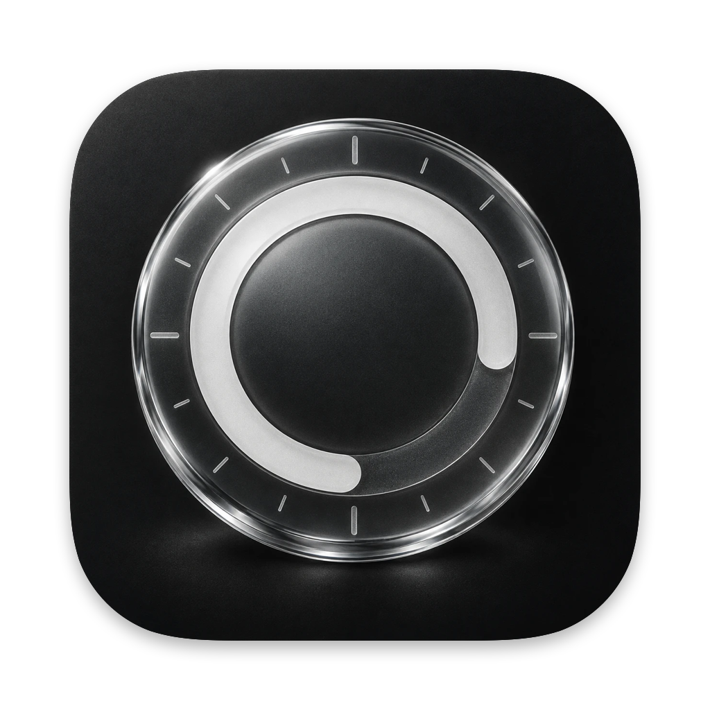
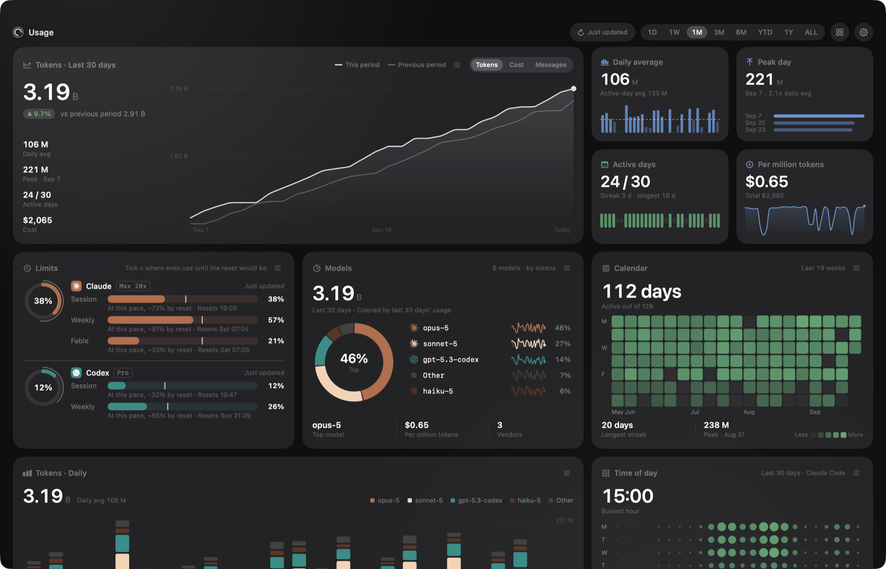
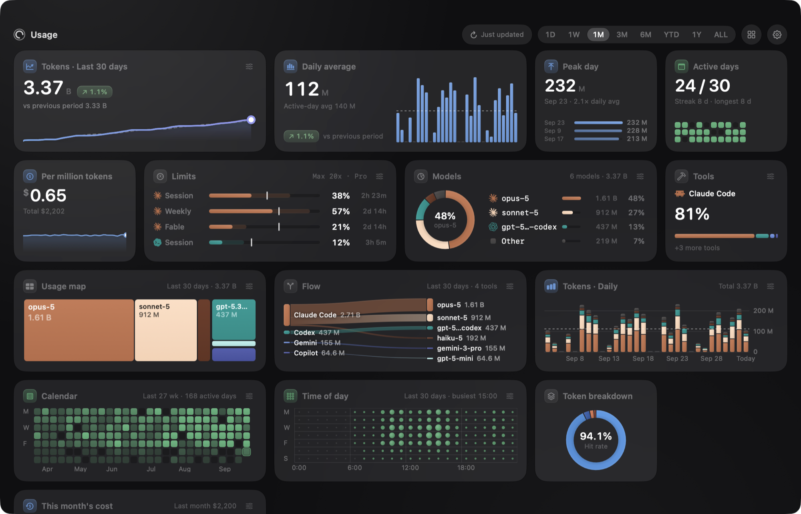
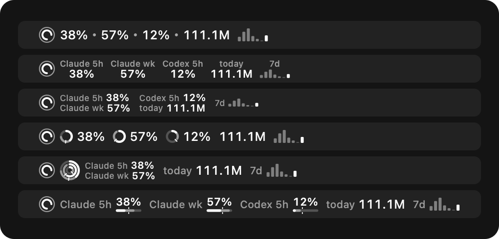
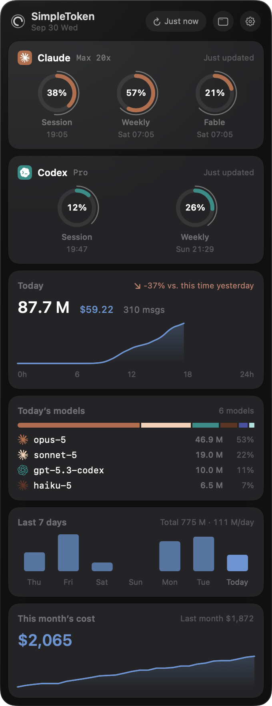
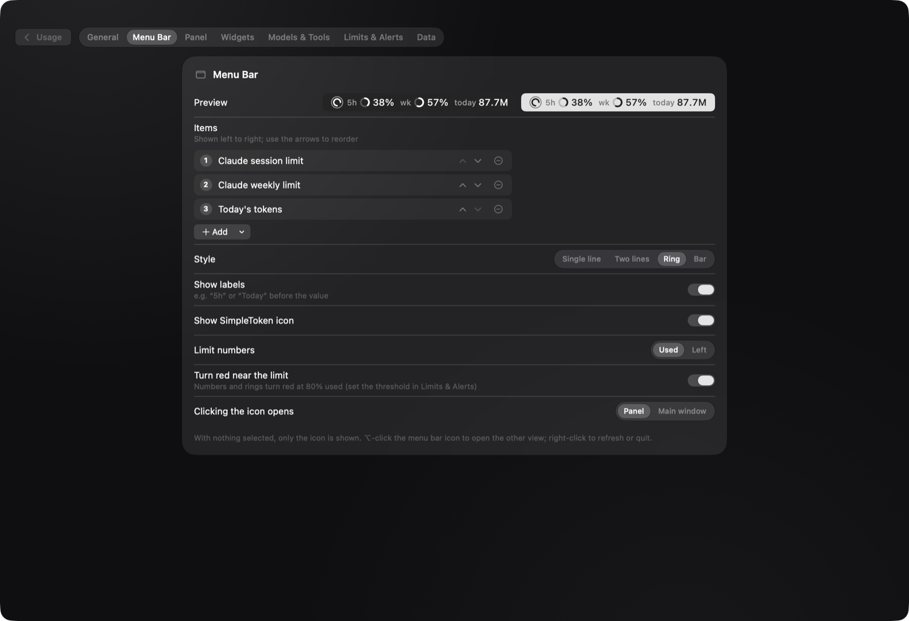

<div align="center">



# SimpleToken

**A native macOS menu-bar app and dashboard for your AI coding usage.**
Tokens, cost and plan limits for Claude Code and Codex, all computed on your Mac.




</div>

## Why SimpleToken

Claude Code and Codex are billed by plan limits that reset every few hours and every week, and the per-token cost is invisible. SimpleToken reads the logs your tools already write, keeps a local history, and shows you where your usage goes: how fast you are burning through the current window, which models do the work, when you work, and what it would have cost at list prices.

- **Native and light.** SwiftUI and Liquid Glass, about 110 MB of memory with the window open and near-zero CPU when idle. Views are torn down when hidden.
- **Private by design.** Usage is computed from local logs. The only network request is the plan-limit check against claude.ai, using a cookie you provide.
- **Yours to arrange.** Every chart is a widget you can drag, resize and configure.

## Features

### A dashboard of widgets

Every chart and stat is a widget in one of four sizes: small (1×1), medium (2×1), large (2×2) or wide (4×2). Each size has its own layout, from a single number with a sparkline to a full chart with a row of key facts. The grid adds columns as the window gets wider while widgets keep roughly the same size. Drag a widget to move it, right-click to resize it, or flip it over to change its options and colour.

<p align="center">
  
</p>

Widgets include:

| Widget | What it shows |
| --- | --- |
| Main chart | Cumulative usage for the selected range against the previous period (or the same period last year) |
| Limits | Claude session, weekly and model windows, Codex windows, pace markers and a projection to the reset |
| Models | Share by model with vendor colours and logos, daily trends and cost per million tokens |
| Usage map | A treemap of your models, grouped by vendor and sized by usage |
| Flow | A flow diagram from tools to the models they used |
| Usage chart | Stacked bars by model or tool, or half-hour bars for a single day with day-by-day navigation |
| Calendar | A heatmap of daily usage with streaks and your busiest day |
| Time of day | A weekday × hour punchcard of when you work |
| Tools | Usage per tool (Claude Code, Codex, Copilot, OpenCode, Gemini) |
| Token breakdown | Cache reads and writes, fresh input and output, and your cache hit rate |
| This month's cost | Month-to-date cost at list prices, a month-end projection and last month for reference |
| Stats | Eight single-number widgets: daily average, peak day, active days, cost per million tokens, total cost, messages, top model and busiest weekday |

Charts are drawn with a shared kit: rounded, softly lit marks that morph when you switch the range or metric. Hover over any of them for details: a day's model and tool breakdown, a half-hour slot, a calendar day ranked against the rest, a punchcard cell with its model mix, or a tool's share of a model. Time ranges run from 1D to ALL.

### Menu bar

Show any mix of Claude and Codex limits, today's tokens or cost, this month's cost and the session reset countdown, as plain text, two lines, mini rings or progress bars. Values turn red near the limit.

<p align="center">
  
</p>

### Drop-down panel

Click the menu-bar item for a compact panel: plan limits, today's usage with a hoverable trend and a comparison with the same time yesterday, today's models and tools, the last seven days and month-to-date cost. Choose the sections, their order and the panel width.

<p align="center">
  
</p>

### Alerts and settings

Optional notifications when a limit crosses thresholds you choose. Settings cover model colours (vendor palettes or a colour-blind-safe set), aliases, which models and tools count towards the totals, refresh intervals and launch at login.

<p align="center">
  
</p>

## Install

Download `SimpleToken-<version>.zip` from [Releases](https://github.com/HanlunWang/SimpleToken/releases), unzip it and move `SimpleToken.app` to `/Applications`. It needs macOS 26 or later on Apple silicon. Releases are signed with a Developer ID and notarized by Apple, so the app opens without a warning.

SimpleToken lives in the menu bar. Click its icon for the panel, or ⌥-click for the main window.

## Getting your usage in

SimpleToken never asks you to sign in to it. It reads what your coding tools already record on this Mac, so there are two separate things to set up.

**1. Usage (tokens, cost, models, tools): nothing to configure.** Keep using your tools on this Mac while signed in to them as usual. SimpleToken picks up their local logs automatically:

| Tool | What to do |
| --- | --- |
| Claude Code | Sign in once with `claude` (Claude subscription or API key). Sessions are logged to `~/.claude/projects`. |
| Codex (CLI or app) | Sign in once with `codex login` or in the Codex / ChatGPT app. Sessions are logged under `~/.codex`. |
| GitHub Copilot CLI, OpenCode, Gemini CLI | Use them as usual; their local logs are read if present. |

A model shows up as soon as a tool has logged a request with it, grouped by vendor (Anthropic, OpenAI, Google and others). Nothing appears for tools you haven't used on this Mac. Half-hour (1D) detail is available for Claude Code only.

**2. Plan limits (optional).**

- **Claude:** limits come from claude.ai. Sign in to claude.ai in your browser, open Developer Tools → Application → Cookies → `https://claude.ai`, copy the value of `sessionKey` (it starts with `sk-ant-`) and paste it into Settings → Limits & Alerts. It is stored only on this Mac, in a file only your user can read. If limits stop updating after you sign out of claude.ai, paste a fresh value. The plan name (for example Max 20x) is read from Claude Code's keychain item, so macOS may ask once whether SimpleToken can read "Claude Code-credentials".
- **Codex:** nothing to paste. SimpleToken asks the local `codex app-server` (read-only, no approvals), which uses your existing Codex sign-in. It finds `codex` inside Codex.app or ChatGPT.app, in `~/.local/bin`, or in Homebrew.

## Build from source

Requirements: macOS 26 or later on Apple silicon, Xcode 26 or later, and [XcodeGen](https://github.com/yonaskolb/XcodeGen) (`brew install xcodegen`).

```bash
git clone https://github.com/HanlunWang/SimpleToken.git
cd SimpleToken
xcodegen generate
xcodebuild -project SimpleToken.xcodeproj -scheme SimpleToken -configuration Release -derivedDataPath build build
open build/Build/Products/Release/SimpleToken.app
```

The app is signed ad-hoc by default, which is enough to run it on the Mac that built it. To sign with your own certificate, create `Config/Signing.local.xcconfig` (it is git-ignored):

```
CODE_SIGN_IDENTITY = Apple Development
DEVELOPMENT_TEAM = YOUR_TEAM_ID
```

Run the unit tests with `cd SimpleTokenKit && swift test`. Releases are built, signed and notarized by GitHub Actions when a version tag is pushed; see [docs/RELEASING.md](docs/RELEASING.md).

## Where the data comes from

| Data | Source |
| --- | --- |
| Daily tokens, cost, models and tools | The bundled [tokscale](https://github.com/junhoyeo/tokscale) CLI, which scans the local logs of Claude Code, Codex, Copilot, OpenCode and Gemini |
| Half-hour usage | Claude Code session logs in `~/.claude/projects` (only timestamps, model ids and token counts are read, never conversation content) |
| Claude plan limits | The claude.ai usage endpoint, with your `sessionKey` cookie |
| Claude plan name | The subscription tier from Claude Code's keychain item (the token itself is not read) |
| Codex plan limits | The local `codex app-server` (read-only, no approvals) |

Everything else stays in `~/Library/Application Support/SimpleToken/`. Costs are estimates at public list prices; subscription plans are billed differently.

## Languages

The interface is available in English and Simplified Chinese and follows your macOS language. Translations live in [`App/Localizable.xcstrings`](App/Localizable.xcstrings); new languages are welcome.

## Project layout

```
App/                 app shell, String Catalog, app icon
Config/              signing settings
SimpleTokenKit/      Swift package
  Core/              collection, analytics, limits, persistence (no UI)
  DesignSystem/      palette, glass components, brand logos
  Features/          widgets, dashboard, settings, menu bar, windows
Resources/tokscale/  bundled tokscale binary
designs/logo/        icon sources
docs/                architecture notes and screenshots
project.yml          XcodeGen spec
```

Contributor notes are in [AGENTS.md](AGENTS.md) and [docs/ARCHITECTURE.md](docs/ARCHITECTURE.md). To take screenshots or demo the app without your own data, launch it with `SIMPLETOKEN_DEMO=1` (synthetic data; nothing is read or written).

## Acknowledgements

- [tokscale](https://github.com/junhoyeo/tokscale) by Junho Yeo, which does the heavy lifting of reading agent logs (MIT)
- Brand logos from [AI Logo](https://github.com/yldm-tech/ai-logo), a fork of LobeHub's lobe-icons (MIT)

See [THIRD_PARTY_NOTICES.md](THIRD_PARTY_NOTICES.md).

## License

[MIT](LICENSE). SimpleToken is an independent project and is not affiliated with or endorsed by Anthropic, OpenAI, GitHub or Google. Product names and logos belong to their owners.
